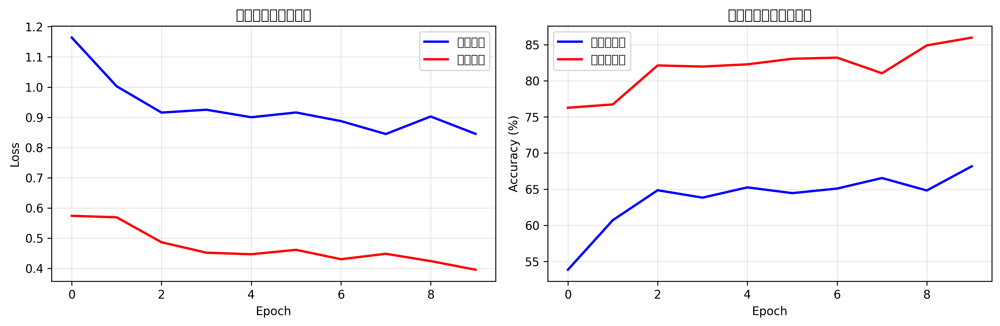

# ResNet18 花卉分类项目

##项目成果
- **测试准确率**: 84.13%
- **最佳验证准确率**: 85.98%
- **训练准确率**: 66.1%
- **训练时间**: 31.2分钟
- **模型大小**: 44.7 MB

##项目简介
使用 PyTorch 和预训练的 ResNet18 模型，实现对5种常见花卉的图像分类。本项目展示了完整的深度学习工作流程，从数据准备到模型训练、评估和结果分析。

##实验结果

### 性能概览
| 指标 | 结果 |
|------|------|
| 测试准确率 | 84.13% |
| 最佳验证准确率 | 85.98% |
| 训练准确率 | 66.1% |
| 训练轮数 | 10 epochs |
| 批大小 | 8 |
| 训练时间 | 31.2分钟 |

### 训练历史曲线


### 简版训练曲线


### 性能分析
1. **模型表现良好**: 84.13%的测试准确率表明模型能有效区分5种花卉
2. **存在欠拟合**: 训练准确率(66.1%)低于验证准确率(85.98%)，表明模型还有优化空间
3. **泛化能力强**: 在未见过的测试集上表现稳定

## 快速开始

### 1. 克隆项目
```bash
git clone https://github.com/Yyyyuan1029/ResNet18-Flower-Classification1.0
cd ResNet18-花卉分类1.0